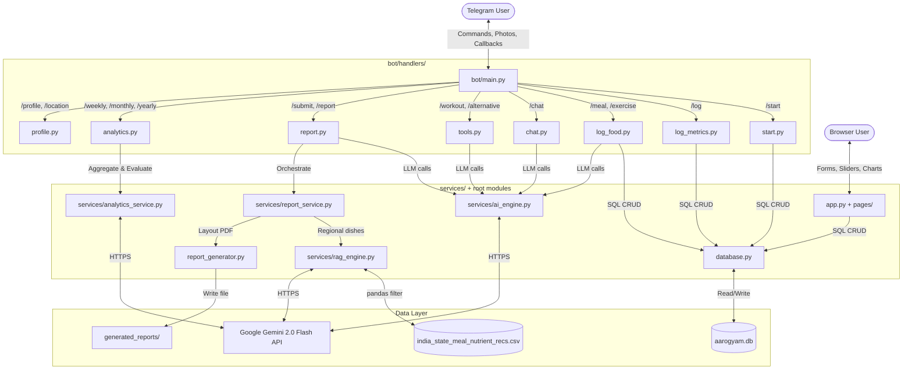
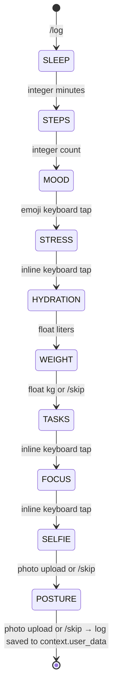

# AarogyamAI — Complete Technical Blueprint & Repository Reference

> **Purpose of this document**: Any AI or human reading this file should have the equivalent understanding of sitting inside the repository with every file open. Every architectural decision, algorithm, state machine, prompt template, database query, and function signature is documented here.

---

## 📂 Complete Repository Directory Tree

```text
aarogyamai/
├── .streamlit/
│   └── config.toml                          # Streamlit theme & server config (dark mode, primary color)
├── assets/
│   ├── DejaVuSans.ttf                       # Regular Unicode TrueType font (BMP range) for PDF body text
│   ├── DejaVuSans-Bold.ttf                  # Bold variant for PDF headers and section titles
│   └── DejaVuSans-Oblique.ttf               # Italic variant for PDF annotations and disclaimers
├── bot/
│   ├── __init__.py                          # Empty package marker
│   ├── main.py                              # Bot entry point: polling loop, command registration, cron jobs, callback router
│   └── handlers/
│       ├── __init__.py                      # Empty package marker
│       ├── start.py                         # 9-state ConversationHandler for user onboarding (/start)
│       ├── log_metrics.py                   # 10-state ConversationHandler for daily metric logging (/log)
│       ├── log_food.py                      # Stateless handlers for /meal and /exercise logging
│       ├── chat.py                          # Persistent-memory health chatbot (/chat) with image analysis
│       ├── report.py                        # Daily submission pipeline (/submit) and latest report fetch (/report)
│       ├── profile.py                       # Profile viewer with inline edit callbacks (/profile, /location)
│       ├── tools.py                         # Interactive workout generator (/workout) and eco-search (/alternative)
│       └── analytics.py                     # Progress trend commands (/weekly, /monthly, /yearly)
├── services/
│   ├── __init__.py                          # Empty package marker
│   ├── ai_engine.py                         # Gemini 2.0 Flash SDK wrapper (text, vision, search grounding, JSON)
│   ├── analytics_service.py                 # Time-series aggregation and Gemini progress synthesis
│   ├── rag_engine.py                        # Regional meal RAG: pandas CSV filter + Gemini recipe generation
│   └── report_service.py                    # Thin facade ensuring report directory exists before PDF generation
├── pages/
│   └── 1_Log_Daily_Metrics.py               # Streamlit subpage for manual metric entry (sliders, dropdowns)
├── rag_data/
│   └── india_state_meal_nutrient_recs.csv   # 28-state Indian regional dish nutrient database (CSV)
├── generated_reports/                       # Auto-created directory where PDF reports are saved
├── uploads/                                 # Auto-created directory for user-uploaded photos (selfies, food, chat)
│   ├── chat/                                # Subdirectory for /chat image uploads
│   ├── food/                                # Subdirectory for /meal food photo uploads
│   └── tools/                               # Subdirectory for /alternative image uploads
├── app.py                                   # Streamlit main dashboard (charts, graphs, daily log summaries)
├── config.py                                # Centralized configuration: env vars, st.secrets fallback, path anchoring
├── database.py                              # SQLite schema builder, CRUD operations, cascade protections
├── report_generator.py                      # FPDF2 subclass with custom layout, progress bars, nutrient tables
├── ai_utils.py                              # Legacy bridge: delegates old function calls to services/
├── requirements.txt                         # Python package dependencies
├── .env.example                             # Template for environment variable configuration
├── .gitignore                               # Git exclusions (venv, __pycache__, .env, uploads/, generated_reports/)
├── README.md                                # GitHub-facing project overview and recruiter landing page
└── PROJECT_DOCUMENTATION.md                 # This file — exhaustive technical blueprint
```

---

## 🏗️ High-Level Architecture Diagram



---

## 🔄 Dual-Interface System

AarogyamAI ships with **two user-facing interfaces** that share one unified SQLite database:

| Aspect | Telegram Bot | Streamlit Web Dashboard |
|---|---|---|
| **Entry Point** | `python bot/main.py` | `streamlit run app.py` |
| **Interaction** | Conversational commands, inline buttons, photo uploads | Form inputs, sliders, chart visualizations |
| **Best For** | Mobile-first daily tracking, recruiter demos | Analytical review, historical trend graphs |
| **Database** | Reads/writes `aarogyam.db` | Reads/writes the same `aarogyam.db` |
| **Secrets** | `.env` file via `python-dotenv` | `.env` or Streamlit Cloud `st.secrets` |

---

## 🗄️ Database Schema (Exact DDL)

The schema is created by `database.create_tables()` on every startup:

```sql
CREATE TABLE IF NOT EXISTS users (
    user_id       INTEGER PRIMARY KEY,   -- Telegram user_id (no auto-increment)
    name          TEXT NOT NULL,
    dob           TEXT NOT NULL,          -- Format: YYYY-MM-DD
    height_cm     REAL,
    gender        TEXT,                   -- Male | Female | Other | Prefer not to say
    location_state TEXT,                  -- Indian state name for RAG matching
    city          TEXT,
    food_preference TEXT,                 -- Vegetarian | Vegetarian + Non-Veg
    health_goal   TEXT,                   -- Weight Loss | Weight Gain | Maintain Weight | Improve Fitness | Manage Stress
    medical_conditions TEXT,
    medications   TEXT,
    allergies     TEXT,
    surgical_history TEXT,
    family_history TEXT
);

CREATE TABLE IF NOT EXISTS daily_logs (
    log_id              INTEGER PRIMARY KEY AUTOINCREMENT,
    user_id             INTEGER NOT NULL,
    log_date            TEXT NOT NULL,     -- Format: YYYY-MM-DD
    total_sleep_minutes INTEGER,
    steps               INTEGER,
    mood                TEXT,              -- Emoji + label (e.g. "😊 Happy")
    weight_kg           REAL,
    selfie_path         TEXT,              -- Absolute path to uploaded selfie JPEG
    posture_pic_path    TEXT,              -- Absolute path to uploaded posture photo
    travel_info         TEXT,              -- JSON string: {km, mode, location_changed, new_city, new_state}
    hydration_level     REAL,              -- Liters
    stress_level        TEXT,              -- Low | Mild | Moderate | High | Very High
    task_completion     TEXT,              -- All | Majority | Some | Few | None
    focus_level         TEXT,              -- Very High | High | Medium | Low | Very Low
    FOREIGN KEY(user_id) REFERENCES users(user_id)
);

CREATE TABLE IF NOT EXISTS food_entries (
    food_id        INTEGER PRIMARY KEY AUTOINCREMENT,
    log_id         INTEGER NOT NULL,
    meal_type      TEXT,                  -- Breakfast | Lunch | Dinner | Snack
    food_image_path TEXT,                 -- Absolute path to uploaded food photo
    description    TEXT,                  -- User-provided text description
    FOREIGN KEY(log_id) REFERENCES daily_logs(log_id) ON DELETE CASCADE
);

CREATE TABLE IF NOT EXISTS exercise_entries (
    exercise_id    INTEGER PRIMARY KEY AUTOINCREMENT,
    log_id         INTEGER NOT NULL,
    exercise_type  TEXT,                  -- Gym | Yoga | Running | AI Workout Recommendation
    details        TEXT,
    duration_minutes INTEGER,
    FOREIGN KEY(log_id) REFERENCES daily_logs(log_id) ON DELETE CASCADE
);
```

### Critical Database Behaviors

| Behavior | Implementation |
|---|---|
| **Foreign Keys** | `PRAGMA foreign_keys = ON` on every `get_db_connection()` call |
| **Log Overwrite** | `add_daily_log()` runs `DELETE FROM daily_logs WHERE user_id=? AND log_date=?` before `INSERT`, ensuring only one log per user per day |
| **Cascade Deletes** | `ON DELETE CASCADE` on `food_entries` and `exercise_entries` ensures child rows die with their parent log |
| **Connection Timeout** | `sqlite3.connect(path, timeout=20.0)` prevents `OperationalError: database is locked` during concurrent Telegram/Streamlit access |
| **Row Factory** | `conn.row_factory = sqlite3.Row` enables dictionary-style access (`row['column_name']`) |

### Key Query Functions

| Function | Signature | What It Does |
|---|---|---|
| `add_user` | `(user_data: dict, user_id: int)` | Inserts a new user profile. Uses the Telegram `user_id` as the primary key. |
| `get_user` | `(user_id: int) -> Row` | Returns the user profile row. |
| `user_exists` | `(user_id: int) -> bool` | Checks if user exists via `SELECT 1`. |
| `add_daily_log` | `(log_data: dict) -> int` | Deletes existing log for same date, inserts new log + food/exercise entries, returns `log_id`. |
| `get_full_daily_log` | `(log_id: int) -> dict` | Returns `{log_details, food_entries, exercise_entries}`. |
| `get_logs_in_range` | `(user_id, start_date, end_date) -> list[dict]` | Returns all logs between dates (inclusive), each with nested food/exercise lists. |
| `get_previous_day_image_paths` | `(user_id, current_date) -> dict` | Returns `{selfie_path, posture_pic_path}` from the day before, used for day-over-day comparison. |

---

## ⚙️ Configuration System (`config.py`)

```python
# Secret resolution priority:
# 1. os.getenv(key)                    — local .env or system environment
# 2. streamlit.secrets[key]            — Streamlit Cloud deployment (only if streamlit is imported)
# 3. default value                     — hardcoded fallback

BASE_DIR = os.path.dirname(os.path.abspath(__file__))  # Project root directory

# All paths are absolute, anchored to BASE_DIR:
DATABASE_PATH = get_secret("DATABASE_PATH", os.path.join(BASE_DIR, "aarogyam.db"))
UPLOAD_DIR    = os.path.join(BASE_DIR, "uploads")
REPORT_DIR    = os.path.join(BASE_DIR, "generated_reports")
```

This prevents SQLite database splitting (where running from different directories creates separate `.db` files) and ensures font files, CSV data, and uploads resolve correctly regardless of execution context.

---

## 🤖 Telegram Bot Commands (Complete Reference)

| Command | Parameters | Handler File | Handler Function | Description |
|---|---|---|---|---|
| `/start` | — | `start.py` | `start()` → 9-state `ConversationHandler` | Profile onboarding (name, DOB, gender, height, weight, state, city, food pref, goal) |
| `/log` | — | `log_metrics.py` | `start_log()` → 10-state `ConversationHandler` | Daily metrics questionnaire (sleep, steps, mood, stress, hydration, weight, tasks, focus, selfie, posture) |
| `/meal` | `[text]` or photo | `log_food.py` | `log_meal_cmd()` | Logs a meal entry with optional AI-powered food image analysis |
| `/exercise` | `[type] [mins] [details]` | `log_food.py` | `log_exercise_cmd()` | Logs a workout entry (e.g., `/exercise Gym 45 Chest day`) |
| `/submit` | — | `report.py` | `submit_daily_log()` | Saves log to DB → AI analysis → RAG recommendations → PDF generation → sends file |
| `/report` | — | `report.py` | `get_latest_report()` | Finds and sends the most recent PDF report for the user |
| `/workout` | — | `tools.py` | `workout_cmd()` | Generates AI fitness plan with interactive ⬜/✅ toggle buttons |
| `/alternative` | `[item]` or photo | `tools.py` | `alternative_cmd()` | Web-grounded search for eco-friendly product alternatives |
| `/chat` | `[question]` or photo | `chat.py` | `chat_cmd()` | Multi-turn health assistant with rolling 20-message memory window |
| `/profile` | — | `profile.py` | `view_profile()` | Shows profile card with inline edit buttons for goal and diet |
| `/location` | `[State] [City]` | `profile.py` | `update_location_cmd()` | Quick location update (e.g., `/location Maharashtra Mumbai`) |
| `/weekly` | — | `analytics.py` | `weekly_report_cmd()` | 7-day progress analytics with Gemini evaluation |
| `/monthly` | — | `analytics.py` | `monthly_report_cmd()` | 30-day trend analysis |
| `/yearly` | — | `analytics.py` | `yearly_report_cmd()` | 365-day annual review |
| `/help` | — | `main.py` | `help_cmd()` | Lists all available commands |
| `/cancel` | — | `start.py` / `log_metrics.py` | `cancel()` | Cancels any active conversation |

---

## 🔄 State Machine Definitions

### Onboarding (`/start`) — 9 States
```python
NAME, DOB, GENDER, HEIGHT, WEIGHT, STATE, CITY, FOOD, GOAL = range(9)
```

```mermaid
stateDiagram-v2
    [*] --> NAME : /start (new user)
    [*] --> END : /start (existing user → welcome back)
    NAME --> DOB : text input
    DOB --> GENDER : YYYY-MM-DD validated
    DOB --> DOB : invalid format → re-prompt
    GENDER --> HEIGHT : inline keyboard tap
    HEIGHT --> WEIGHT : numeric cm
    HEIGHT --> HEIGHT : non-numeric → re-prompt
    WEIGHT --> STATE : numeric kg
    STATE --> CITY : text input
    CITY --> FOOD : text input
    FOOD --> GOAL : inline keyboard tap
    GOAL --> [*] : db.add_user() → profile saved
```

### Daily Log (`/log`) — 10 States
```python
SLEEP, STEPS, MOOD, STRESS, HYDRATION, WEIGHT, TASKS, FOCUS, SELFIE, POSTURE = range(10)
```



---

## 🧠 AI Engine Deep Dive (`services/ai_engine.py`)

### Model Configuration
- **Model**: `gemini-2.0-flash` (Google's fastest multimodal model)
- **API Key**: Loaded from `config.GOOGLE_API_KEY`, configured via `genai.configure(api_key=...)`
- **Unified model**: `get_model()`, `get_text_model()`, `get_vision_model()` all return the same `gemini-2.0-flash` instance

### Function: `generate_comprehensive_daily_analysis(user_profile, log_data, prev_day_images)`
This is the core analytical pipeline. It constructs a **multimodal prompt** containing:
1. Text-based user profile (health goal, food preference)
2. Text-based daily metrics (sleep, steps, mood, stress, focus, task completion)
3. Up to 4 images: today's selfie, yesterday's selfie, today's posture, yesterday's posture
4. Food entry descriptions + food photos for each meal

The prompt demands Gemini return a **strict JSON schema**:
```json
{
  "wellness_score": {"score": "1-100", "justification": "..."},
  "physical_activity_analysis": "...",
  "mental_clarity_analysis": "...",
  "daily_image_analysis": {"selfie_analysis": "...", "posture_analysis": "..."},
  "comparative_analysis": {"selfie_feedback": "...", "posture_feedback": "..."},
  "nutrition_analysis": {
    "meal_analyses": [
      {"meal_type": "Breakfast", "nutrition_table": [
        {"component": "Item", "calories": 150, "protein_g": 5, "carbs_g": 25, "fats_g": 5, "vitamins_minerals": "Iron, Vitamin C"}
      ]}
    ],
    "final_summary": {
      "summary": "...", "positives": ["..."], "improvements": ["..."],
      "lacking_nutrient": "Protein | Fiber | Iron | Calcium | Vitamins | Healthy Fats"
    }
  }
}
```

### Function: `get_fitness_plan(user_profile)`
Generates a workout plan as a JSON array: `[{"activity": "...", "duration_or_sets": "..."}]`. Includes a hardcoded fallback plan if Gemini fails.

### Class: `SearchAgentWrapper`
Wraps Gemini's **Google Search grounding** tool: `tools=[{"google_search": {}}]`. Extracts `grounding_metadata.grounding_chunks` from the response to append source URLs. Falls back to standard text generation if grounding fails.

---

## 🍲 Regional RAG Engine (`services/rag_engine.py`)

### CSV Structure (`rag_data/india_state_meal_nutrient_recs.csv`)
Columns: `state`, `dish name`, `meal type`, `description`, `preference` (Veg/Non-Veg), `primary nutrient`, `secondary nutrient`, `tertiary nutrient`, `quaternary nutrient`

### Algorithm
1. **Load**: `pd.read_csv(csv_path)` with column names lowercased and stripped
2. **Filter** (strict): Match `state` + `preference` + any of the 4 nutrient columns against `lacking_nutrient`
3. **Fallback filter**: If strict filter returns empty, relax the `state` constraint (match any state)
4. **Retrieve**: Take top 3 matching dishes
5. **Synthesize**: Pass the retrieved dish names and descriptions to Gemini with a formatting prompt to generate friendly recipe recommendations
6. **Combine**: Return `"General Recommendations:\n...\n\nRegional Recommendations:\n..."`

---

## 📊 Analytics Engine (`services/analytics_service.py`)

### Aggregation Algorithm for `analyze_user_progress(user_id, days)`
1. Fetch all logs in `[today - days, today]` via `db.get_logs_in_range()`
2. For each log, accumulate: `steps`, `total_sleep_minutes`, `hydration_level`, `weight_kg`, `mood`, `stress_level`, exercise `duration_minutes`
3. Calculate averages:
   - `avg_steps = total_steps / total_logs`
   - `avg_sleep_hours = (total_sleep_mins / total_logs) / 60`
   - `avg_water = total_water / total_logs`
4. Weight trajectory: `weight_change = weights[-1] - weights[0]` → "Increased by X kg" / "Decreased by X kg" / "Stable at X kg"
5. Format a statistics summary string with emoji indicators
6. Send statistics + user profile + health goal to Gemini with prompt asking for:
   - Overview & Consistency
   - Metrics Evaluation vs. health goal
   - Progress Direction (improving/regressing/plateauing)
   - 3 actionable recommendations for next week

---

## 💬 Chat Memory System (`bot/handlers/chat.py`)

### Memory Architecture
- **Storage**: `context.user_data['chat_history']` — a Python list of dictionaries
- **Format**: `[{"role": "user", "parts": ["message"]}, {"role": "model", "parts": ["response"]}, ...]`
- **Window Size**: Capped at 20 messages (10 exchanges). When exceeded, oldest messages are trimmed: `chat_history = chat_history[-20:]`
- **Gemini Integration**: History is converted to `genai.types.Content` objects and passed to `model.start_chat(history=gemini_history)`. New messages use `chat.send_message()`
- **System Instruction**: Injected as a prefix to the first user message only, containing the user's name, health goal, and food preference
- **Image Mode**: Photo uploads bypass the persistent chat and use a one-shot `model.generate_content([system_instruction, image, query])` call

---

## 🏋️ Workout Toggle System (`bot/handlers/tools.py`)

### Callback Data Protocol
| Callback Data | Trigger | Action |
|---|---|---|
| `toggleworkout_{index}` | User taps an exercise button | XOR toggle: add/remove index from `completed_workout_indexes` set |
| `save_workouts` | User taps "Save Completed Workouts 💾" | Iterate completed indexes, append to `daily_log['exercise_entries']`, clean temp state |

### Inline Keyboard Rendering
Each exercise renders as an `InlineKeyboardButton` with label `"✅ Activity..."` or `"⬜ Activity..."`. On toggle, `query.edit_message_text()` rebuilds the entire message and keyboard with updated checkmarks.

---

## 📄 PDF Generation Engine (`report_generator.py`)

### Text Sanitization
```python
def sanitize_text(text):
    if not isinstance(text, str): text = str(text)
    return "".join(c for c in text if ord(c) < 0xffff)
```
Keeps all BMP characters (Hindi, French, Spanish, Greek, math symbols) but strips 4-byte emojis that crash fpdf2's font mapping.

### Font Loading
Fonts are loaded in the `PDF.header()` method using absolute paths: `os.path.join(config.BASE_DIR, "assets", "DejaVuSans-Bold.ttf")`. The `try/except RuntimeError: pass` pattern silently skips re-registration when `header()` is called on subsequent pages.

### Step Progress Bar Algorithm (`draw_steps_bar`)
```python
steps = max(0, int(steps or 0))        # None-safe casting
progress_width = min((steps / goal) * bar_width, bar_width)  # Clamp to max
bar_color = (76, 175, 80) if steps >= goal else (239, 83, 80)  # Green if met, red if not
```
Draws a gray background rect + colored progress rect using `pdf.rect(x, y, w, h, style='F')`.

### Metrics Table (Null-Safe)
Each metric (sleep, weight, hydration, mood, stress) is individually checked for `None` before formatting:
```python
sleep_mins = log_data['log_details'].get('total_sleep_minutes')
if sleep_mins is None: sleep_mins = 0
sleep_str = f"{sleep_mins // 60}h {sleep_mins % 60}m"
weight_str = f"{weight} kg" if weight is not None else "N/A"
```

---

## ⏰ Background Reminder System (`bot/main.py`)

### Cron Configuration
```python
app.job_queue.run_daily(
    send_daily_reminders,
    time=datetime.time(hour=20, minute=0, second=0)  # 8:00 PM local
)
```

### Reminder Logic (`send_daily_reminders`)
1. Query: `SELECT user_id, name FROM users`
2. For each user, send a Telegram message via `context.bot.send_message(chat_id=user_id, text=...)` containing prompts to run `/log`, `/meal`, and `/submit`
3. Each send is wrapped in `try/except` so one blocked user doesn't halt all reminders

---

## 🔌 Callback Router (`bot/main.py`)

All inline button callbacks funnel through one global `CallbackQueryHandler(callback_router)`:

```python
async def callback_router(update, context):
    data = query.data
    if data.startswith("meal_"):           → log_food.meal_type_callback()
    elif data.startswith("toggleworkout_") or data == "save_workouts":
                                            → tools.workout_callback()
    elif data.startswith("edit_"):          → profile.profile_edit_callback()
    elif data.startswith("setgoal_"):       → profile.set_goal_callback()
    elif data.startswith("setfood_"):       → profile.set_food_callback()
```

### Caption-Based Photo Routing
Photos with `/meal` in the caption are routed to `log_food.log_meal_cmd` via:
```python
app.add_handler(MessageHandler(filters.Caption(["/meal"]), log_food.log_meal_cmd))
```
Same pattern applies for `/chat` and `/alternative`.

---

## 🚀 Setup & Execution

### Install Dependencies
```bash
pip install python-dotenv python-telegram-bot[ext] google-generativeai pandas streamlit pillow fpdf2 openpyxl cryptography apscheduler
```

### Configure Secrets
Create `.env` in the project root:
```env
TELEGRAM_BOT_TOKEN="your_telegram_bot_token"
GOOGLE_API_KEY="your_gemini_api_key"
```

### Run
```bash
# Telegram Bot (conversational interface)
python bot/main.py

# Streamlit Dashboard (visual analytics)
streamlit run app.py
```

Both share the same `aarogyam.db` database. Data logged via Telegram appears in Streamlit charts and vice versa.
