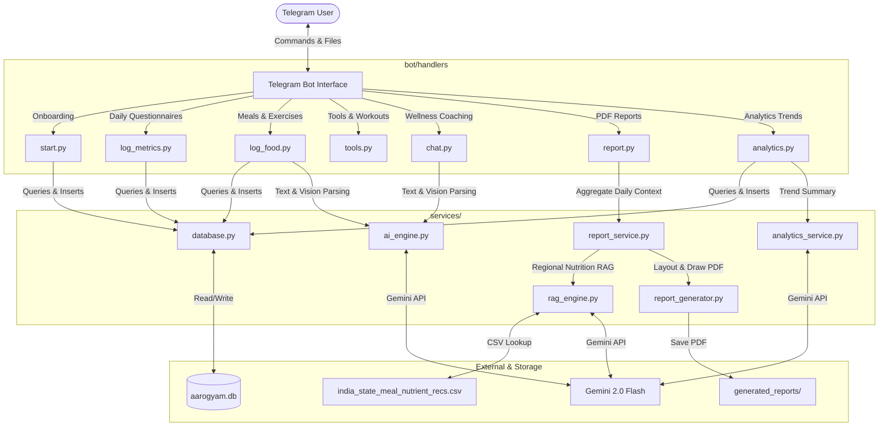
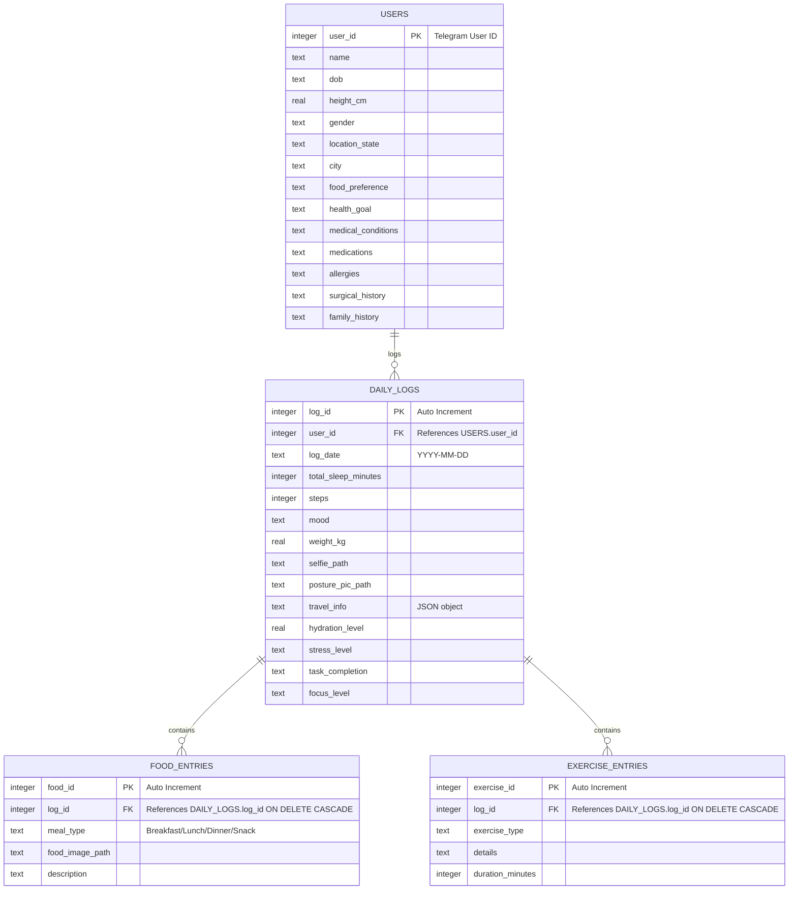
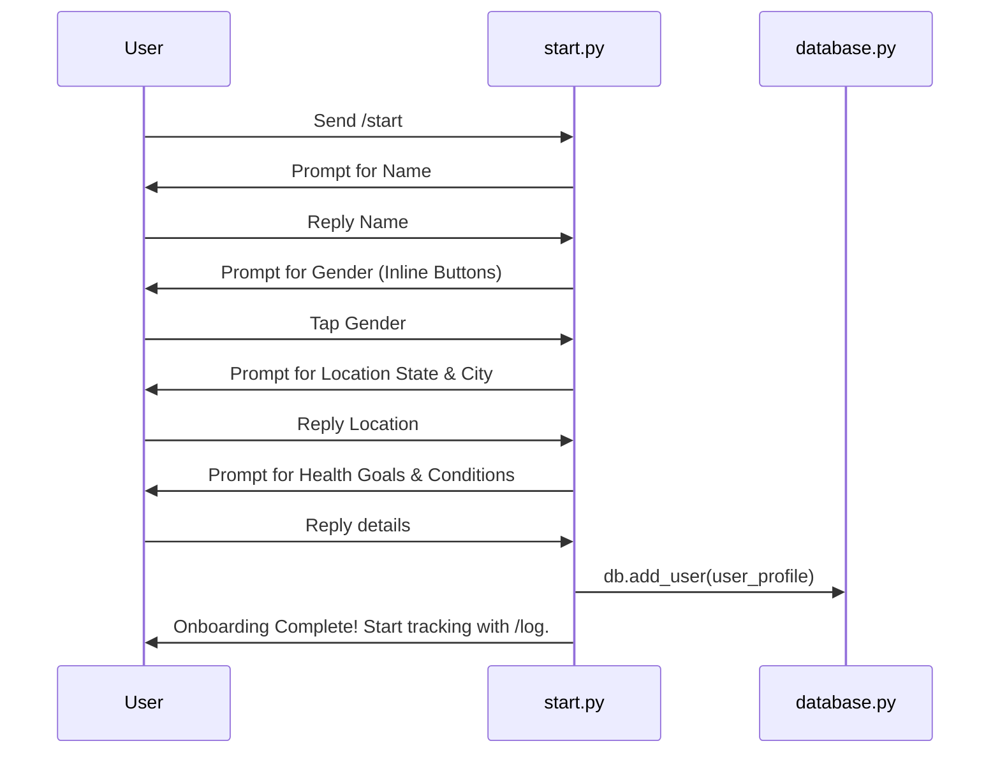
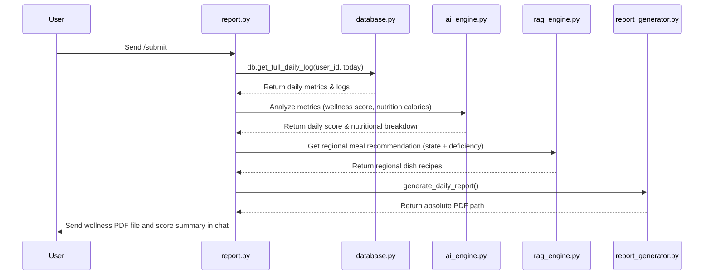

# AarogyamAI - Technical Architecture & Documentation

AarogyamAI is a production-grade, multimodal clinical wellness companion delivered directly through **Telegram**. It is designed to track daily physical and mental metrics, analyze nutrition through text or image inputs, recommend regional Indian recipes via a localized RAG engine, generate clinical-grade PDF summaries, and track health trends over time.

---

## 🏗️ System Architecture

AarogyamAI uses a modular service-oriented architecture written in Python, combining a SQLite database, a regional RAG (Retrieval-Augmented Generation) CSV engine, and the Gemini 2.0 Flash API.



---

## 🗄️ Database Schema & Storage Strategy

All user profiles, daily metrics, logs, food entries, and workout exercises are persisted inside a local SQLite database (`aarogyam.db`). The database is designed as a structured time-series store:



### Key Integrity & Overwrite Protections
1. **Foreign Key Enforcement**: `PRAGMA foreign_keys = ON;` is run on every database connection. This guarantees that deleting a daily log automatically clears all associated `food_entries` and `exercise_entries` via `ON DELETE CASCADE`, preventing orphan rows.
2. **Duplicate Overwrite Protection**: Inside `add_daily_log()`, the engine queries the database to see if a log already exists for that `user_id` and `log_date`. If found, it deletes the existing log and cascades its sub-entries *before* inserting the new one. This allows users to re-submit their daily logs without duplicating metrics.

---

## 🧠 Service Layer & Logic Breakdowns

### 1. Multimodal AI Engine (`services/ai_engine.py`)
This engine encapsulates interactions with the Gemini 2.0 Flash model. It is completely cloud-ready and handles:
*   **Nutrition Analysis**: Parses food description texts or uploaded meal photos. It extracts calorie estimates, protein, carbs, fats, and key micro-nutrients, returning them as structured tables.
*   **Multimodal Prescription & Wound Scanner**: Integrates with the `/chat` command. Users can upload prescriptions or photos of cuts/burns. Gemini extracts details, scans ingredients, and acts as a safe, preliminary triage assistant.
*   **Alternative Search Grounding**: A wrapper (`SearchAgentWrapper`) utilizing Gemini's native Google Search grounding. If a user asks for healthy alternatives (e.g., `/alternative plastic water bottle`), Gemini runs a real-time web search and lists verified, eco-friendly alternatives with local Indian links.

### 2. Regional RAG Engine (`services/rag_engine.py`)
A custom regional RAG system that provides location-specific nutritional recommendations:
*   **CSV Index**: Located in `rag_data/india_state_meal_nutrient_recs.csv`, mapping Indian states, meal types, and regional dishes to target nutrients (e.g., iron-rich foods in Karnataka like *Ragi Mudde*).
*   **Search Logic**: Retrieves matching regional dishes based on:
    - User's state of residence (`location_state`).
    - User's diet preference (Vegetarian, Non-Vegetarian, Vegan).
    - The nutrient lacking in the user's daily meals (identified during the nutrition summary run).
*   **Synthesis**: The retrieved records are sent to Gemini to compile custom, step-by-step recipe outlines and advice suited to the user's region.

### 3. Historical Analytics Engine (`services/analytics_service.py`)
Tracks health trajectories and provides progress analytics:
*   **Averages Calculation**: Aggregates steps, sleep duration, and water intake over a period (7 days, 30 days, or 365 days).
*   **Weight Trajectory**: Checks the oldest vs newest weight entry to determine weight loss/gain.
*   **Mental Indicators**: Compiles mood frequencies and stress logs to map mental wellness.
*   **Comparative Progress Review**: Gemini reviews the compiled statistical history alongside the user's profile and health goals (e.g., weight loss) to write a detailed summary explaining whether the user is improving, plateauing, or regressing.

### 4. PDF Generation Engine (`report_generator.py`)
A customized subclass of `FPDF` (fpdf2) that creates clean daily reports:
*   **Layout Structure**: Features custom grid cards, step goals progress bars (drawn using geometric rects), and tables outlining calorie intake.
*   **Unicode BMP Sanitization**: Sanitizes text input to filter out high-byte color emojis (`> 0xffff`) while preserving Standard Unicode BMP characters (`< 0xffff`). This enables seamless multi-lingual rendering (e.g., Hindi characters or accents) without crashing the DejaVu font compiler.
*   **Font Isolation**: Fonts are resolved dynamically relative to `config.BASE_DIR`, preventing missing font file crashes.

---

## 🤖 Telegram Commands Directory

| Command | Parameters | Scope / State | Description |
|---|---|---|---|
| **`/start`** | None | Public | Initiates the step-by-step conversational onboarding flow. Saves profile to the DB. |
| **`/profile`** | None | Registered | Displays user demographics, health goals, and medical conditions with inline edit buttons. |
| **`/location`** | `[State] [City]` | Registered | Quick location update command (e.g., `/location Karnataka Bengaluru`). |
| **`/log`** | None | Conversation | Starts the multi-step daily questionnaire mapping steps, sleep, water, mood, and photos. |
| **`/meal`** | `[description]` | Registered | Logs a meal. Supports text descriptions or photo uploads with `/meal` in the caption. |
| **`/exercise`** | `[type] [duration] [details]` | Registered | Logs an exercise entry to the current daily log. |
| **`/submit`** | None | Registered | Triggers the daily analysis pipeline and generates the downloadable wellness PDF report. |
| **`/report`** | None | Registered | Downloads the user's latest daily PDF wellness report. |
| **`/workout`** | None | Registered | Generates a daily exercise checklist. Mark off items with interactive checkboxes (⬜/✅). |
| **`/alternative`** | `[item]` | Public | Web-grounded search agent to find healthy, eco-friendly alternatives (optional photo support). |
| **`/chat`** | `[message]` | Public | Multi-turn health chat assistant. Keeps message history. Supports images (prescriptions/skin checks). |
| **`/weekly`** | None | Registered | Generates a 7-day progress review evaluating trends against your primary health goals. |
| **`/monthly`** | None | Registered | Generates a 30-day health trends analysis. |
| **`/yearly`** | None | Registered | Generates a 365-day overview mapping progress. |
| **`/help`** | None | Public | Displays descriptions of all available bot commands. |

---

## 🔄 Sequence Flows

### 1. Onboarding Flow (`/start`)


### 2. Daily Log Submission (`/submit`)


---

## 🔒 Reliability Features & Safety Policies

1. **Path-Independent Configuration**: Exposed directory references (`UPLOAD_DIR`, `REPORT_DIR`, `DATABASE_PATH`) inside `config.py` are absolute paths anchored to `config.BASE_DIR` (project root). This guarantees the script executes cleanly from cron processes, Docker containers, or subfolders without misplacing data.
2. **Background Reminder Pings**: Inside `bot/main.py`, a daily automated background task is scheduled via `JobQueue` (leveraging `APScheduler`). It fires at **8:00 PM local time** every evening, scanning the database to identify users who haven't logged metrics today, and sending them reminders.
3. **Clinical Disclaimer Policy**: Every AI consultation, chat response, skin scan, or prescription summary is automatically appended with a bold clinical disclaimer:
   > **⚠️ Disclaimer**: This is an AI wellness evaluation, not a medical diagnosis. Please consult a qualified practitioner before modifying your medication or exercise routines.

---

## 🔄 Dual-Interface System

AarogyamAI features a unique **dual-interface capability** sharing the same unified time-series database backend (`aarogyam.db`). This allows recruiters or users to choose their preferred method of interaction:

1. **Telegram Companion Bot**: A mobile-first, highly conversational, and interactive interface for daily updates, notifications, chat coaching, prescription parsing, and PDF report downloads.
2. **Streamlit Web Dashboard**: A web-based analytical panel that displays charts, step records, sleep habits, hydration, and historical summaries. If you register or log metrics on Telegram, the graphs on the Streamlit dashboard automatically update in real-time!

---

## 🚀 Setup & Execution Guide

### Prerequisite Dependencies
Install the required packages using pip:
```bash
pip install python-dotenv python-telegram-bot[ext] google-generativeai pandas streamlit pillow fpdf2 openpyxl cryptography apscheduler
```

### Configuration Setup
Create a `.env` file in the project root:
```env
TELEGRAM_BOT_TOKEN="your_telegram_bot_token"
GOOGLE_API_KEY="your_gemini_api_key"
DATABASE_PATH="aarogyam.db"
```

### Running the Services

#### Option A: Running the Telegram Bot (Conversational Interface)
Simply launch the bot process:
```bash
python bot/main.py
```
Open Telegram, search for your bot's username, and send `/start` to begin tracking your wellness journey.

#### Option B: Running the Streamlit Web App (Visual Dashboard)
To launch the local web interface, execute:
```bash
streamlit run app.py
```
This opens the analytical dashboard in your web browser at `http://localhost:8501`.

