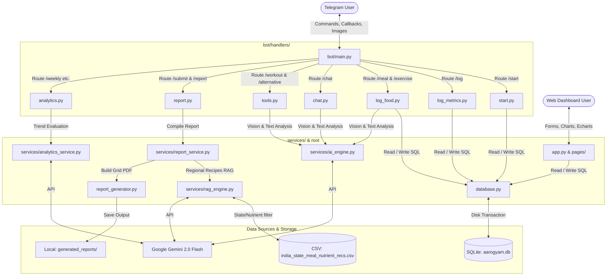
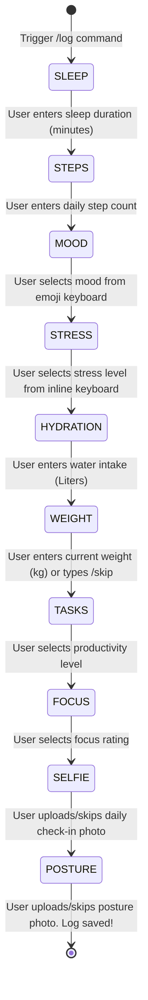

# AarogyamAI - Complete Technical Blueprint & Repository Manual

AarogyamAI is a production-grade, dual-interface clinical wellness platform integrated with **Telegram** and **Streamlit**. It functions as an AI-powered fitness companion, localized nutritionist, mental clarity coach, and time-series progress analyzer.

This document serves as a complete repository blueprint, explaining every architectural layer, database schema, state machine transition, and code algorithm in minute detail.

---

## 📂 Repository Directory Tree

Below is the complete file layout of the repository:

```text
aarogyam-ai/
├── .streamlit/
│   └── config.toml             # Streamlit visual configurations (theme, colors)
├── assets/
│   ├── DejaVuSans-Bold.ttf     # Bold TrueType font for PDF Unicode support
│   ├── DejaVuSans-Oblique.ttf  # Oblique/Italic TrueType font for PDF
│   └── DejaVuSans.ttf          # Regular TrueType font for PDF
├── bot/
│   ├── __init__.py
│   ├── handlers/
│   │   ├── __init__.py
│   │   ├── analytics.py        # /weekly, /monthly, /yearly handlers
│   │   ├── chat.py             # Chatbot handler (/chat) with rolling message memory
│   │   ├── log_food.py         # Meal and exercise logger handlers (/meal, /exercise)
│   │   ├── log_metrics.py      # Steps, sleep, mood, stress logging ConversationState handler
│   │   ├── profile.py          # /profile view, location updates, and inline callback targets
│   │   ├── report.py           # Daily submission pipeline (/submit) and /report downloader
│   │   ├── start.py            # Conversational onboarding handler (/start)
│   │   └── tools.py            # /workout generators, checklists, and /alternative search agent
│   └── main.py                 # Bot initialization, global callback router, and reminder cron
├── services/
│   ├── __init__.py
│   ├── ai_engine.py            # Gemini 2.0 Flash interfaces (multimodal text/vision/search)
│   ├── analytics_service.py    # Metric range calculators and AI progress synthesizers
│   ├── rag_engine.py           # Regional meal RAG (pandas CSV query + Gemini recipe synth)
│   └── report_service.py       # Facade orchestrating PDF generation and directories setup
├── rag_data/
│   └── india_state_meal_nutrient_recs.csv  # Indian regional meal nutrient recipes database
├── pages/
│   └── 1_Log_Daily_Metrics.py  # Streamlit page for logging daily metrics manually
├── app.py                      # Main Streamlit web application dashboard (graphs and stats)
├── database.py                 # SQLite database builder, transactions, and tables connection
├── config.py                   # Centralized configuration, .env loader, and st.secrets fallback
├── report_generator.py         # Layout and design definitions for PDF generator (FPDF2)
├── ai_utils.py                 # Bridge module maintaining legacy backwards-compatibility
├── requirements.txt            # Python dependencies lists
├── .env.example                # Configuration settings template
└── PROJECT_DOCUMENTATION.md    # This technical documentation manual
```

---

## 🏗️ High-Level Technical Architecture

AarogyamAI employs a modular, service-oriented structure designed to decouple user-facing presentation layers (Telegram or Streamlit) from core health analytics, databases, and LLM services.



---

## 🗄️ Database Schema Definitions (SQL)

The SQLite database stores user profiles and historical log entries. To recreate the database tables exactly, the following DDL statements are executed inside `database.py` during startup:

```sql
-- 1. User Profiles Table
CREATE TABLE IF NOT EXISTS users (
    user_id INTEGER PRIMARY KEY,
    name TEXT NOT NULL,
    dob TEXT NOT NULL,
    height_cm REAL,
    gender TEXT,
    location_state TEXT,
    city TEXT,
    food_preference TEXT,
    health_goal TEXT,
    medical_conditions TEXT,
    medications TEXT,
    allergies TEXT,
    surgical_history TEXT,
    family_history TEXT
);

-- 2. Daily Log Entries Table
CREATE TABLE IF NOT EXISTS daily_logs (
    log_id INTEGER PRIMARY KEY AUTOINCREMENT,
    user_id INTEGER NOT NULL,
    log_date TEXT NOT NULL,
    total_sleep_minutes INTEGER,
    steps INTEGER,
    mood TEXT,
    weight_kg REAL,
    selfie_path TEXT,
    posture_pic_path TEXT,
    travel_info TEXT, -- Saved as a JSON String
    hydration_level REAL,
    stress_level TEXT,
    task_completion TEXT,
    focus_level TEXT,
    FOREIGN KEY(user_id) REFERENCES users(user_id)
);

-- 3. Meal Logs Table (One-to-Many with daily_logs)
CREATE TABLE IF NOT EXISTS food_entries (
    food_id INTEGER PRIMARY KEY AUTOINCREMENT,
    log_id INTEGER NOT NULL,
    meal_type TEXT, -- Breakfast, Lunch, Dinner, Snack
    food_image_path TEXT,
    description TEXT,
    FOREIGN KEY(log_id) REFERENCES daily_logs(log_id) ON DELETE CASCADE
);

-- 4. Exercises Log Table (One-to-Many with daily_logs)
CREATE TABLE IF NOT EXISTS exercise_entries (
    exercise_id INTEGER PRIMARY KEY AUTOINCREMENT,
    log_id INTEGER NOT NULL,
    exercise_type TEXT,
    details TEXT,
    duration_minutes INTEGER,
    FOREIGN KEY(log_id) REFERENCES daily_logs(log_id) ON DELETE CASCADE
);
```

### Database Integrity Features:
*   **Cascade Deletion**: SQLite foreign keys constraint checking is manually enabled on every connection using `conn.execute("PRAGMA foreign_keys = ON")`. If a user updates their daily log, the cascade deletion automatically cleans the dependent `food_entries` and `exercise_entries` tables, preventing data pollution.
*   **Transaction Safety**: All insertions and deletions use parameterized bindings (`?`) to prevent SQL Injection.

---

## 🔄 State Machines & Conversational Flows

### 1. Daily Metrics Questionnaire State Machine (`/log`)
`bot/handlers/log_metrics.py` implements a complex `ConversationHandler` utilizing Telegram's conversational state engine. It guides users through logging daily stats one prompt at a time:



*   **Skip Mechanics**: Users can type `/skip` at almost any step (except sleep/steps) to skip optional variables.
*   **Error Handling**: If a user enters non-numeric text for sleep, steps, water, or weight, the handler catches the exception, reports the formatting error, and prompts for that exact state again without losing progress.

---

## 🗃️ Detailed Code & Algorithm Breakdown (File-by-File)

### ⚙️ Root Infrastructure Files

#### 1. [config.py](file:///d:/Projects/aarogyamai/config.py)
*   **Purpose**: Exposes global configuration parameters and secures environment variables.
*   **Implementation**: 
    - Uses `dotenv` to load local keys.
    - Added Streamlit support: checks if `'streamlit' in sys.modules`. If running in Streamlit, it falls back to checking `streamlit.secrets` keys.
    - Exposes absolute path properties anchored to `config.BASE_DIR` (`DATABASE_PATH`, `UPLOAD_DIR`, `REPORT_DIR`), preventing execution-context directory drifts.

#### 2. [database.py](file:///d:/Projects/aarogyamai/database.py)
*   **Purpose**: SQLite CRUD wrapper module.
*   **Core Functions**:
    - `get_db_connection()`: Instantiates connection to `config.DATABASE_PATH`, sets `timeout=20.0` to prevent database locks, sets `row_factory = sqlite3.Row`, and runs `PRAGMA foreign_keys = ON;`.
    - `create_tables()`: Runs database setup DDL.
    - `add_daily_log(log_data)`: Implements **log-overwrite protection**. Queries the table for existing logs matching the date and user ID. If a duplicate exists, deletes it (triggering cascade deletes for linked foods/exercises) before inserting the new stats.
    - `get_logs_in_range(user_id, start_date, end_date)`: Queries `daily_logs` where `log_date` is between boundaries, constructs logs dictionaries, queries linked foods and exercises, and merges them into a list.

#### 3. [report_generator.py](file:///d:/Projects/aarogyamai/report_generator.py)
*   **Purpose**: PDF Layout Design Class extending FPDF2.
*   **Core Algorithms & Tricks**:
    - **BMP Text Sanitization**:
      ```python
      def sanitize_text(text):
          if not isinstance(text, str):
              text = str(text)
          return "".join(c for c in text if ord(c) < 0xffff)
      ```
      This filters out high-byte emojis (`> 0xffff`) which crash the PDF generator font maps, but fully preserves international characters (like Hindi, French, Spanish) which reside under `0xffff`.
    - **Step Progress Bar Graphing**: `draw_steps_bar(pdf, steps, goal)` calculates `(steps / goal) * bar_width`. It draws a background rectangle (gray) and a progress rectangle (green if steps $\ge$ goal, red if steps $<$ goal) using `pdf.rect()`, presenting a visual dashboard in the PDF.

---

### 🌐 Web Dashboard Layer

#### 4. [app.py](file:///d:/Projects/aarogyamai/app.py)
*   **Purpose**: Streamlit landing page displaying health metrics.
*   **Implementation**:
    - Queries the database for user logs.
    - Uses `st.line_chart` and `st.bar_chart` to render trends over time (weight loss curves, sleep patterns, steps histograms, water intake).
    - Lists daily log summaries, image check-ins, and regional diet recommendations in a sidebar panel.

#### 5. [pages/1_Log_Daily_Metrics.py](file:///d:/Projects/aarogyamai/pages/1_Log_Daily_Metrics.py)
*   **Purpose**: Alternative manual web page input dashboard.
*   **Implementation**:
    - Provides text inputs and sliders for users to submit their daily steps, sleep, hydration, weight, mood, and meals.
    - Directly writes to `database.add_daily_log()` so data propagates instantly to the Telegram bot modules.

---

### 🧠 Analytics & Service Layer

#### 6. [services/ai_engine.py](file:///d:/Projects/aarogyamai/services/ai_engine.py)
*   **Purpose**: Gemini 2.0 Flash SDK client wrapper.
*   **Core Functionality**:
    - `analyze_food_input_multimodal(description, image_path)`: Resolves food nutrition. If an image is provided, loads it via `PIL.Image`, passes both text prompt and image bytes to Gemini, and parses the returned JSON containing calorie estimates and macro details.
    - `SearchAgentWrapper`: Implements Gemini's **Google Search grounding**. Queries alternatives (e.g., "healthy replacement for plastic toothbrushes") using real-time search engine results, outputting local alternative options.

#### 7. [services/rag_engine.py](file:///d:/Projects/aarogyamai/services/rag_engine.py)
*   **Purpose**: Location-specific nutritionist recipe recommender.
*   **Algorithm**:
    - Resolves the CSV path relative to this script: `os.path.join(base_dir, "rag_data", "india_state_meal_nutrient_recs.csv")`.
    - Reads the database into a pandas DataFrame: `df = pd.read_csv(csv_path)`.
    - Filters rows based on user's target state, dietary preferences, and lacking nutrient:
      ```python
      filtered_df = df[
          (df['state'].str.lower() == state.lower()) & 
          (df['diet_preference'].str.lower() == preference.lower()) &
          (df['nutrient_rich_in'].str.lower() == lacking_nutrient.lower())
      ]
      ```
    - Passes the filtered subset to Gemini along with a formatting prompt to synthesize regional recipes.

#### 8. [services/analytics_service.py](file:///d:/Projects/aarogyamai/services/analytics_service.py)
*   **Purpose**: Statistical trend tracker over time.
*   **Algorithm**:
    - Computes mathematical averages for steps, sleep duration, and water intake over a target timeframe.
    - Evaluates weight direction:
      $$\text{Weight Change} = \text{Latest Weight} - \text{Initial Weight}$$
      Outputs whether weight is stable, increased, or decreased, and formats raw numeric inputs into user-friendly strings.
    - Generates a clinical progress summary via Gemini 2.0 Flash comparing the user's statistics to their long-term health goals.

---

### 🤖 Telegram Bot Layer (`bot/handlers/` & `bot/main.py`)

#### 9. [bot/main.py](file:///d:/Projects/aarogyamai/bot/main.py)
*   **Purpose**: Telegram bot polling initialization and background reminders cron setup.
*   **Reminder Job Logic**:
    - Schedules a daily background task at **8:00 PM local time** using `python-telegram-bot`'s `JobQueue` built on `APScheduler`.
    - Queries the database for all registered users, checks if they have submitted a log today, and sends reminder alerts to those who haven't.
    - Defines a global `callback_router()` to delegate inline button clicks (such as workout completion callbacks) to their respective handlers.

#### 10. [bot/handlers/start.py](file:///d:/Projects/aarogyamai/bot/handlers/start.py)
*   **Purpose**: Guided profile registration conversation.
*   **Implementation**:
    - Guides users through entering their name, date of birth, location, food preferences, goals, and medical history.
    - Saves profile details using the Telegram `user_id` as the primary key.

#### 11. [bot/handlers/log_metrics.py](file:///d:/Projects/aarogyamai/bot/handlers/log_metrics.py)
*   **Purpose**: Conversational daily logger.
*   **Implementation**:
    - Implements a multi-turn questionnaire mapping variables step-by-step.
    - Saves uploaded selfie and posture photos directly inside `config.UPLOAD_DIR` with a unique UUID naming convention, saving path strings to the DB.

#### 12. [bot/handlers/log_food.py](file:///d:/Projects/aarogyamai/bot/handlers/log_food.py)
*   **Purpose**: Logging meals (`/meal`) and exercises (`/exercise`).
*   **Implementation**:
    - `/meal` queries `ai_engine.analyze_food_input_multimodal()` to parse food logs.
    - `/exercise` saves workout duration and types to the SQL database.

#### 13. [bot/handlers/tools.py](file:///d:/Projects/aarogyamai/bot/handlers/tools.py)
*   **Purpose**: `/workout` generation and `/alternative` grounding search.
*   **Workout Checkbox Logic**:
    - Clicking an exercise toggle button triggers the `callback_router`.
    - The code parses the callback data, updates the database log, and updates the inline keyboard checkboxes in real-time between `⬜` and `✅`.

#### 14. [bot/handlers/chat.py](file:///d:/Projects/aarogyamai/bot/handlers/chat.py)
*   **Purpose**: Health chatbot with context memory.
*   **Context Memory Logic**:
    - Saves previous message transcripts in `context.user_data['chat_history']` as a rolling deque structure.
    - Passes the chat history context directly to the Gemini chat object, allowing the model to recall previous prompts.

#### 15. [bot/handlers/report.py](file:///d:/Projects/aarogyamai/bot/handlers/report.py)
*   **Purpose**: Orchestrates daily wellness report building.
*   **Implementation**:
    - Gathers today's food, exercises, and metrics.
    - Calculates calories and logs deficiency targets.
    - Queries the RAG engine for regional dishes.
    - Compiles details, calls `report_generator.py`, and replies with the PDF file in Telegram.

#### 16. [bot/handlers/analytics.py](file:///d:/Projects/aarogyamai/bot/handlers/analytics.py)
*   **Purpose**: Handles `/weekly`, `/monthly`, and `/yearly` queries.
*   **Implementation**:
    - Calls `analytics_service.analyze_user_progress()` to calculate trends and returns the synthesized markdown progress review.

---

## 🚀 Unified Setup & Execution Guide

### Prerequisite Dependencies
Install the required packages:
```bash
pip install python-dotenv python-telegram-bot[ext] google-generativeai pandas streamlit pillow fpdf2 openpyxl cryptography apscheduler
```

### Configuration Setup
Create a `.env` file in the project root:
```env
TELEGRAM_BOT_TOKEN="your_telegram_bot_token"
GOOGLE_API_KEY="your_gemini_api_key"
DATABASE_PATH="aarogyam.db"
```

### Execution Commands
*   **Run Telegram Bot (Companion Engine)**:
    ```bash
    python bot/main.py
    ```
*   **Run Streamlit Dashboard (Visual Console)**:
    ```bash
    streamlit run app.py
    ```
Both instances run in parallel, automatically reading and writing to the same `aarogyam.db` file.
